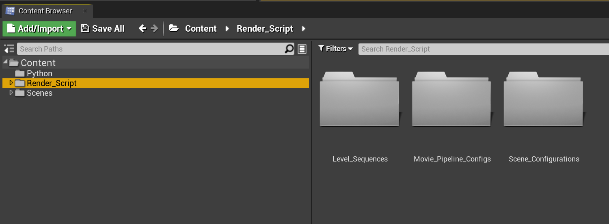
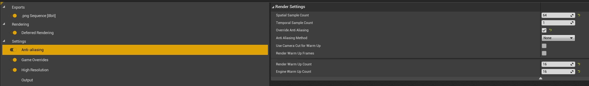
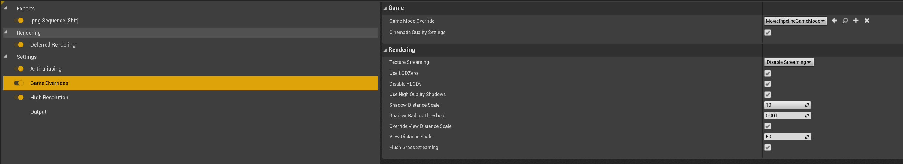
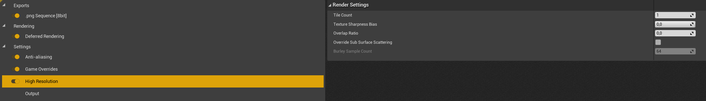
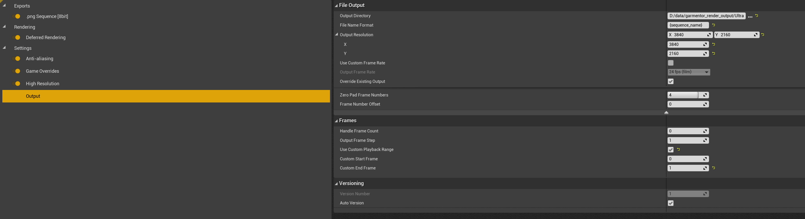

# Unreal Engine Setup

1. Go to `Edit -> Plugins` and make sure that `Python Editor Script Plugin` and `Movie Render Queue` are activated
    - consult [this](https://docs.unrealengine.com/4.27/en-US/RenderingAndGraphics/RayTracing/MovieRenderQueue/) for more information on the `Movie Render Queue` plugin

2. Your `Render_Script` directory should contain three folders: 
    - `Level_Sequences` will be empty and `Scene_Configurations` should've been populated by the `blender_import.py` script
3. Inside of `Movie_Pipeline_Configs`, create a movie pipeline master config file for your render setup
    - we show our config file for 4k rendering below (settings not shown are left at default):

